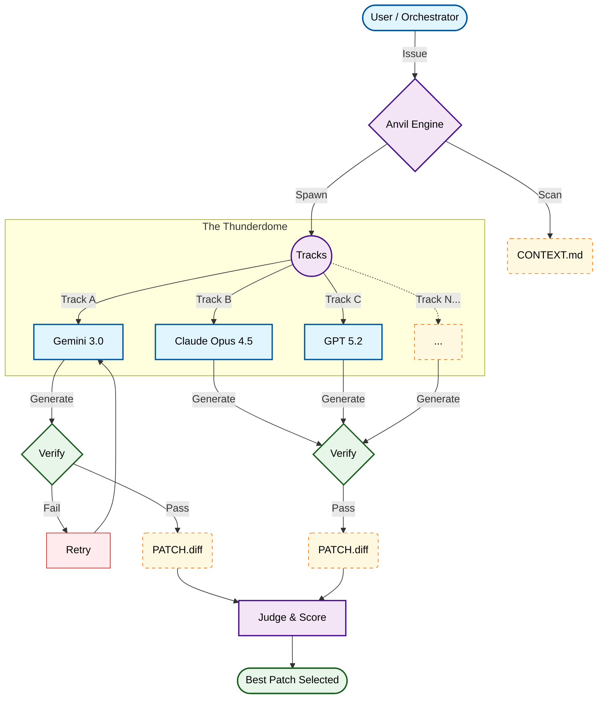

# Anvil

<p align="center">
  
</p>

<p align="center">
  <b>The "No-Vibes" Debugging & Hardening Orchestrator</b>
</p>

<p align="center">
  <a href="QUICKSTART.md">⚡️ Quickstart</a> •
  <a href="docs/CONTRACT.md">📜 The Contract</a> •
  <a href="CONTRIBUTING.md">🛠 Contributing</a> •
  <a href="docs/AGENT_ONBOARDING.md">🤖 Agent Guide</a>
</p>

<p align="center">
  <b>✅ Production Ready</b> • 55/55 Tests Passing • Robust Worktree Management • Deterministic Judging
</p>

---

## 🛑 THE PROBLEM: Agent Entropy

AI coding agents are brilliant, but they are **chaotic**.

- They **hallucinate** files that don't exist.
- They **regress** existing features while fixing new ones.
- They claim a bug is "FIXED" based on **vibes**, not evidence.

To safely use agents in production, you currently have to manage git worktrees, context windows, and verification loops manually.

## 🛡 THE SOLUTION: A Deterministic Forge

**Anvil** is a Python harness that forces agents to sign a **Contract**. It treats code modification as a hostile activity that must be isolated, verified, and judged.

Anvil provides the **infrastructure of mistrust**:

1.  **Isolation:** Every debug track runs in a dedicated `git worktree`.
2.  **Proof:** No fix is accepted without a reproduction plan and a passing test.
3.  **Competition:** Run multiple agents (Gemini, Copilot, Claude) in parallel; only the one that _actually_ fixes the bug wins.

---

## ⚙️ WORKFLOW

Anvil automates the lifecycle of a bug fix. It creates a "Thunderdome" for bugs where multiple agents enter, and only one patch leaves.



---

## ⚡️ QUICKSTART

> **Impatience is a virtue.**  
> Go to the [**Quickstart Guide**](QUICKSTART.md) to debug your first repo in < 5 minutes.

### 1. Install

```bash
git clone https://github.com/grahama1970/anvil.git
cd anvil
pip install -e .
```

### 2. Run the Debugger

Navigate to any broken repository and summon the agents:

```bash
# Initialize Anvil configuration
anvil init

# Validate your environment
anvil doctor

# Fix a bug
anvil debug run --issue "Login button crashes on mobile devices"
```

### 3. Or... Break Your Code

Use **Harden Mode** to Red-Team your own code. Anvil will unleash "Breaker" agents to find vulnerabilities.

```bash
anvil harden run
```

---

## 💻 API (FOR ORCHESTRATORS)

Anvil is designed to be imported by _other_ agents (like a master orchestrator). It returns structured data, not just text.

```python
import anvil

# 1. Debug a known bug
# Returns a verified patch or raises an error
result = anvil.debug(
    repo="/path/to/repo",
    issue="Database connection timeout on heavy load",
    tracks_file="config/tracks.yaml"
)

if result["status"] == "OK":
    print(f"Winner: {result['winner']}")
    print(f"Patch Path: {result['patch_file']}")

# 2. Harden a codebase
# Returns findings and patches (no single "winner")
security_scan = anvil.harden(
    repo="/path/to/repo",
    focus="Find SQL injection vulnerabilities"
)
print(security_scan["findings"])  # HARDEN.md content
```

---

## 🧱 THE "NO VIBES" GUARANTEE

A track is **DISQUALIFIED** immediately if it violates the [System Contract](docs/CONTRACT.md):

| Violation        | Consequence                                                                 |
| :--------------- | :-------------------------------------------------------------------------- |
| **Schema Drift** | If an agent returns invalid JSON, it is killed.                             |
| **No Proof**     | If an agent claims "Fixed" without a `PATCH.diff`, it is disqualified.      |
| **Lazy Repro**   | If an agent skips the reproduction step, it fails.                          |
| **Broken Tests** | If verify returns FAIL, the patch is rejected. Judge penalizes -100 points. |

---

## 🔌 PROVIDERS

Anvil is model-agnostic. Define your "team" in `.dbg/tracks.yaml`:

```yaml
tracks:
  - name: architect
    role: debugger
    provider: copilot
    model: claude-sonnet
    budgets:
      max_iters: 3
  - name: intern
    role: experimental
    provider: gemini
    model: gemini-1.5-flash
    budgets:
      max_iters: 2
```

**Available Providers:**

- `manual` - generates iteration templates (works offline)
- `copilot` - GitHub Copilot CLI
- `gemini` - Gemini CLI
- `claude` - Anthropic Claude (API/CLI)
- `gh_cli` - GitHub CLI as backend transport

---

## 🔧 ADVANCED FEATURES

### Worktree Cleanup

Anvil automatically manages git worktrees, but you can manually control cleanup:

```bash
# Clean worktrees for a specific run
anvil cleanup run --run-id <run_id>

# List all active worktrees
anvil cleanup list

# Clean stale worktrees older than 7 days
anvil cleanup stale --older-than 7

# DANGER: Remove all Anvil worktrees
anvil cleanup all
```

**Automatic Cleanup:** By default, worktrees are cleaned on success and preserved on failure. Control this with:

- `--no-cleanup` - Never auto-cleanup (for debugging)
- `--cleanup-always` - Always cleanup, even on failure

### Harden Mode with Verification

Run full verification loops on breaker patches:

```bash
anvil harden run --verify-patches
```

This applies each patch, runs tests, and performs robust cleanup between iterations.

### Docker Isolation

Run all verification steps in Docker for true isolation:

```bash
anvil debug run --issue "Bug description" --docker
```

---

## 🚨 TROUBLESHOOTING

### "Worktree validation failed"

**Cause:** Stale branches from previous crashed runs or non-git repo.

**Fix:**

```bash
# Clean specific run
anvil cleanup run --run-id <run_id>

# Or clean everything
anvil cleanup all
```

### "Repo is not a git repository"

**Cause:** Target directory is missing `.git`.

**Fix:** Ensure you're in a git repository:

```bash
cd /path/to/your/repo
git status  # Should work
anvil init
```

### Environment Health Check

Always run `anvil doctor` before starting:

```bash
anvil doctor
```

This checks:

- Git availability and repo status
- Docker connectivity
- Provider CLIs (GitHub, Copilot, Gemini, Claude)
- Authentication status
- Verification contract validity

---

## 📚 Documentation

- **[Agent Onboarding Guide](docs/AGENT_ONBOARDING.md)**: For AI agents integrating Anvil
- **[Quickstart Guide](QUICKSTART.md)**: Get up and running in 5 minutes
- **[Contributing Guide](CONTRIBUTING.md)**: How to develop and extend Anvil
- **[System Contract](docs/CONTRACT.md)**: The "No Vibes" guarantee

---

## 🏗️ Attribution & Inspiration

**Anvil** is a Python reimplementation and extension of [nicobailon/debug-mode](https://github.com/nicobailon/debug-mode), a TypeScript-based debugging skill. Anvil adds new capabilities like **harden mode**, N-track configuration, worktree isolation, and a Python API for orchestrators.

---

<p align="center">
<sub>Forged in code. Hardened in fire.</sub>
</p>
